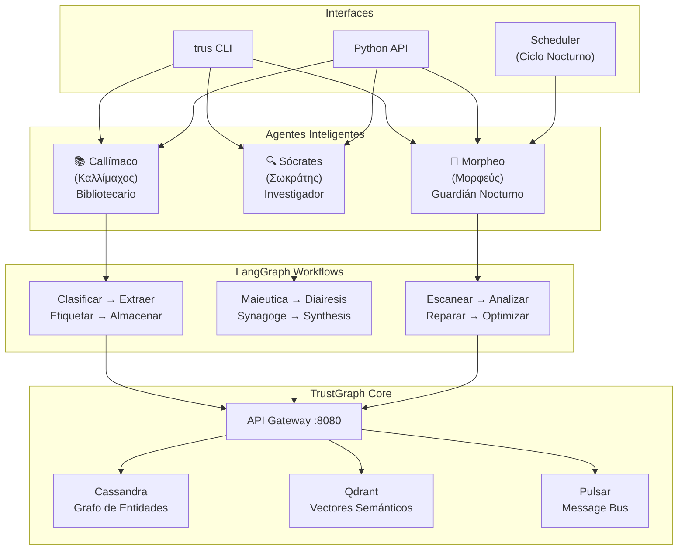
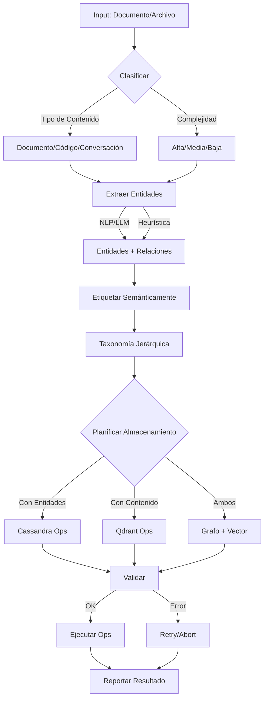
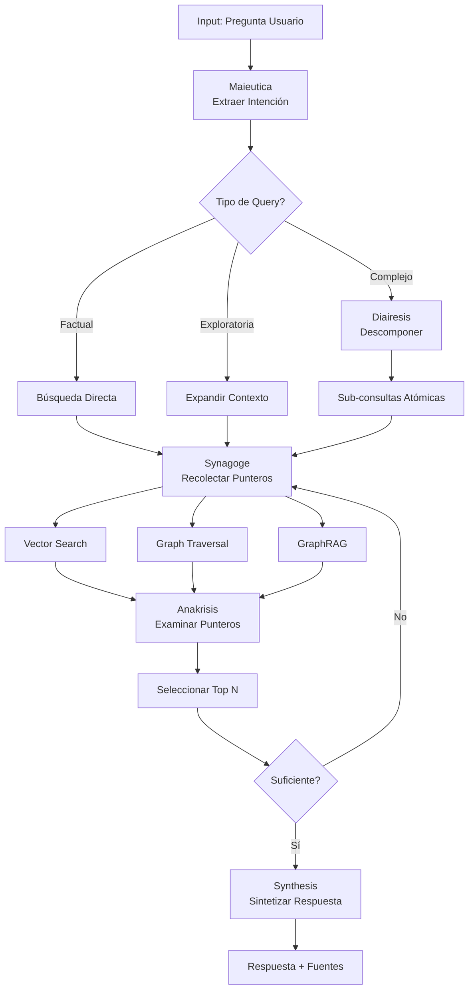
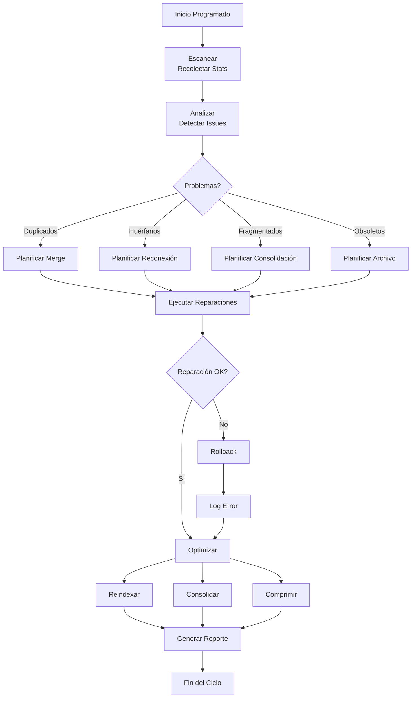

# 🏛️ Arquitectura de TrustGraph Agents

## Diagrama de Arquitectura



## Flujo de Datos Detallado

### 📚 Callímaco - Flujo de Indexación



### 🔍 Sócrates - Flujo de Investigación



### 🌙 Morpheo - Ciclo Nocturno



## Componentes del Sistema

### Estados (State Classes)

```python
# CallimacoState
@dataclass
class CallimacoState:
    content: str                    # Contenido a procesar
    content_type: ContentType       # Tipo de contenido
    entities: List[Entity]          # Entidades extraídas
    relations: List[Relation]       # Relaciones extraídas
    semantic_tags: SemanticTags     # Etiquetas jerárquicas
    storage_plan: StoragePlan       # Plan de almacenamiento

# SocratesState
@dataclass
class SocratesState:
    original_query: str             # Pregunta original
    query_type: QueryType           # Tipo de consulta
    subqueries: List[SubQuery]      # Sub-consultas
    search_results: List[SearchResult]
    selected_pointers: List[Pointer]
    final_answer: str

# MorpheoState
@dataclass
class MorpheoState:
    session_id: str
    memory_stats: Dict
    issues_found: List[MemoryIssue]
    repair_queue: List[RepairPlan]
    optimization_queue: List[OptimizationJob]
```

### Decisiones Condicionales

Cada agente usa un grafo de decisión con nodos condicionales:

**Callímaco**:
- ¿Clasificación exitosa? → Extraer / Error
- ¿Tiene entidades? → Etiquetar / Saltar a Planificar
- ¿Plan válido? → Almacenar / Reintentar / Error

**Sócrates**:
- ¿Query compleja? → Descomponer / Buscar directo
- ¿Suficientes punteros? → Sintetizar / Rebuscar
- ¿Alta confianza? → Responder / Sugerir refinamiento

**Morpheo**:
- ¿Tiempo disponible? → Continuar / Terminar
- ¿Issues críticos? → Reparar primero
- ¿Reparación exitosa? → Optimizar / Rollback

## Estrategias de Almacenamiento

| Contenido | Cassandra | Qdrant | Decisión |
|-----------|-----------|--------|----------|
| Doc largo con entidades | ✅ Entidades + Relaciones | ✅ Chunks + Embeddings | `GRAFO_Y_VECTOR` |
| Doc corto con entidades | ✅ Entidades | ❌ | `SOLO_GRAFO` |
| Texto semántico puro | ❌ | ✅ Vectores | `SOLO_VECTOR` |
| Referencia/link | ✅ Metadatos | ❌ | `METADATA` |

## API de los Agentes

### Callímaco

```python
# Async
result = await callimaco.indexar(
    content="...",
    content_type=ContentType.DOCUMENTO,
    source="archivo.md"
)

# Sync
result = callimaco.indexar_sync(...)
```

**Retorno**:
```json
{
  "success": true,
  "content_hash": "a1b2c3d4...",
  "entities_extracted": 12,
  "relations_extracted": 8,
  "storage_plan": {
    "destination": "grafo_y_vector",
    "cassandra_ops": 20,
    "qdrant_ops": 5
  },
  "semantic_tags": {
    "categoria_primaria": "arquitectura_software",
    "temas": ["microservicios", "api_gateway"]
  }
}
```

### Sócrates

```python
result = await socrates.investigar(
    query="¿Cómo funciona X?",
    context={"historial": [...]}
)
```

**Retorno**:
```json
{
  "respuesta": "...",
  "confianza": 0.92,
  "punteros": [
    {
      "id": "vec_001",
      "tipo": "vector",
      "source": "doc_123",
      "relevancia": 0.95,
      "acceso": "/api/v1/vectors/doc_123",
      "snippet": "..."
    }
  ],
  "estrategia": {
    "tipo_query": "analitica",
    "complejidad": 0.75,
    "subconsultas": 3
  }
}
```

### Morpheo

```python
result = await morpheo.ejecutar_ciclo(
    max_duration_minutes=360,
    intensity="normal"  # ligero | normal | profundo
)
```

**Retorno**:
```json
{
  "success": true,
  "session_id": "morpheo_20240115_020000",
  "reparaciones_hechas": 15,
  "optimizaciones_hechas": 3,
  "reporte": {
    "issues_detectados": 23,
    "duracion_minutos": 187.5,
    "stats_antes": {...},
    "stats_despues": {...}
  }
}
```

## Integración con CLI

```
trusb
├── agente
│   ├── bibliotecario
│   │   ├── indexar <archivo> [--tipo] [--etiquetas]
│   │   └── indexar-dir <directorio> [--extensiones]
│   ├── investigador
│   │   ├── preguntar "texto" [--modo]
│   │   └── preguntar -i  (interactivo)
│   └── nocturno
│       ├── ciclo [--intensidad] [--duracion]
│       └── programar [--hora] [--frecuencia]
└── status
```

## Scheduling

### Programación de Morpheo

```bash
# Diario a las 2 AM
0 2 * * * /usr/local/bin/trus agente nocturno ciclo --intensidad ligero

# Semanal (domingos) profundo
0 2 * * 0 /usr/local/bin/trus agente nocturno ciclo --intensidad profundo
```

## Métricas y Observabilidad

Cada agente reporta:

**Callímaco**:
- Tiempo de procesamiento
- Entidades extraídas por tipo
- Distribución de destinos de almacenamiento
- Tasa de éxito/fracaso

**Sócrates**:
- Número de subconsultas generadas
- Estrategias utilizadas
- Puntuaciones de relevancia promedio
- Confianza de respuestas

**Morpheo**:
- Issues detectados por categoría
- Tiempo de reparación
- Mejora de métricas (antes/después)
- Errores y rollbacks

## Escalabilidad

### Procesamiento Paralelo

```python
# Callímaco puede procesar múltiples archivos
await asyncio.gather(*[
    callimaco.indexar(archivo)
    for archivo in batch
])

# Sócrates ejecuta subconsultas en paralelo
await asyncio.gather(*[
    socrates._ejecutar_busqueda(subq)
    for subq in subqueries
])
```

### Batching

- **Callímaco**: Procesa documentos en lotes de 100
- **Morpheo**: Reparaciones en lotes de 100 IDs

## Seguridad

- Validación de inputs en cada nodo
- Rollback automático en errores
- Sanitización de metadatos
- Límites de rate en operaciones

## Roadmap

- [ ] Integración con LLM real (OpenAI/Anthropic)
- [ ] Web UI para monitoreo de agentes
- [ ] Colaboración entre agentes (multi-agent)
- [ ] Aprendizaje de preferencias del usuario
- [ ] Optimización automática de estrategias
